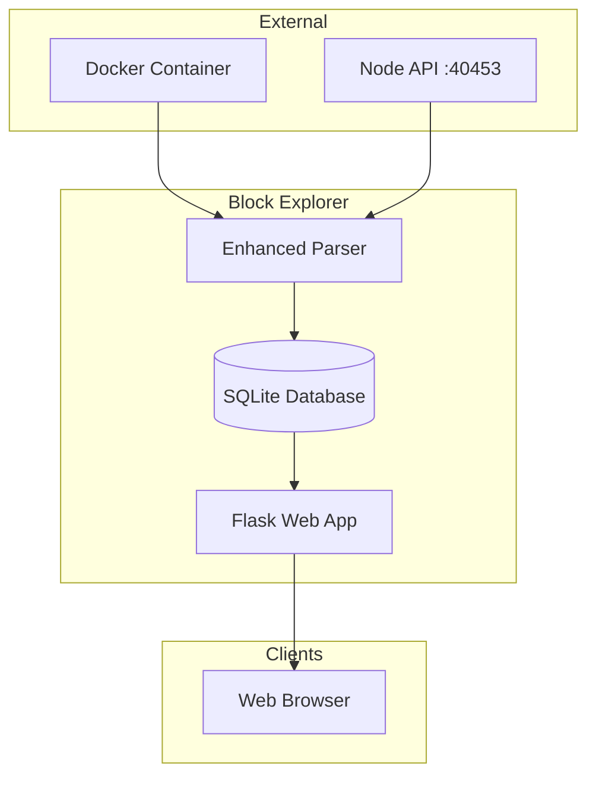
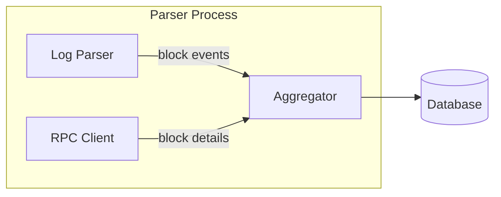
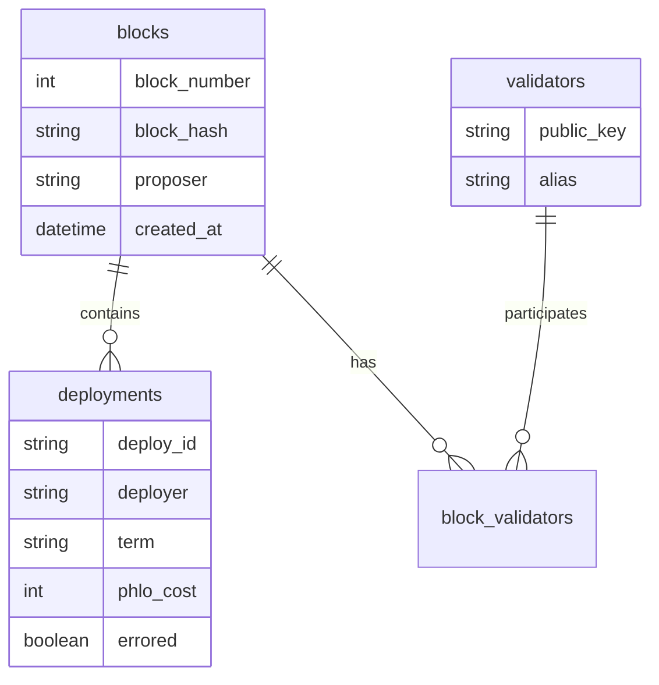

# Block Explorer Architecture

The Block Explorer is a Flask web application that indexes and displays blockchain data.

← [Back to Component Diagrams](../)

## High-Level Overview



## Data Processing

The Enhanced Parser continuously indexes blockchain data.



| Component | Function |
|-----------|----------|
| Log Parser | Read Docker logs |
| RPC Client | Query block details |
| Aggregator | Combine and store |

## Database Schema

SQLite stores indexed blockchain data.



## Web Interface

Flask serves both HTML pages and REST API endpoints.

```mermaid
graph TD
    subgraph "Routes"
        HTML[HTML Pages]
        API[REST API]
    end
    
    HTML --> H1[/ - Block list]
    HTML --> H2[/block/:hash - Details]
    
    API --> A1[/api/blocks]
    API --> A2[/api/deployments]
    API --> A3[/api/validators]
    API --> A4[/api/wallet/:address]
```

## API Endpoints

| Endpoint | Method | Returns |
|----------|--------|---------|
| `/api/blocks` | GET | Block list with pagination |
| `/api/block/<hash>` | GET | Block details + deployments |
| `/api/validators` | GET | Active validator list |
| `/api/wallet/<address>` | GET | Balance + transaction history |
| `/api/transfers` | GET | Recent transfers |

## Data Sources

| Source | Data Type | Access Method |
|--------|-----------|---------------|
| Docker logs | Block creation events | `docker logs` command |
| Node RPC | Block details, deploys | `show-blocks`, `show-block` |
| Node HTTP | Balance queries | `/api/explore-deploy` |

---

## Related Documentation

- [Explorer Usage Guide](/explorer/usage/) - How to use the explorer
- [Explorer Query Flow](../../sequence-diagrams/) - Data retrieval sequence
- [Network Topology](../../network-topology/) - Node connections
