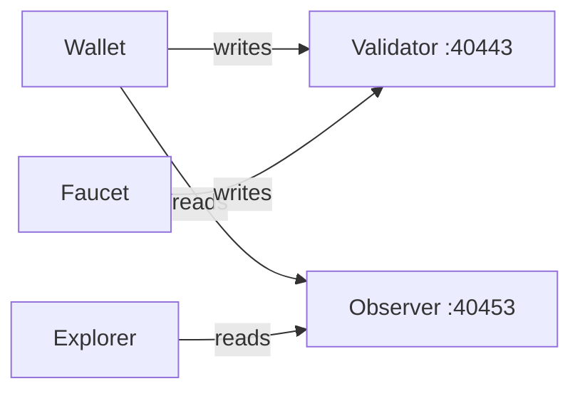

# Component Diagrams

Internal architecture diagrams for ASI:Chain ecosystem components.

← [Back to Architecture Overview](../)

## Available Components

### [Wallet Architecture](./wallet/)

The ASI Wallet v2 browser-based React application.

- UI Layer structure
- Redux state management
- Services and node connections

### [Block Explorer Architecture](./explorer/)

Flask-based blockchain data indexer and viewer.

- Data processing pipeline
- Database schema
- API endpoints

### [ASI Node Architecture](./node/)

ASI Scala blockchain node.

- Core services
- Port configuration  
- P2P networking

## Quick Reference

| Component | Technology | Main Function |
|-----------|------------|---------------|
| Wallet | React + Redux | Account management, transactions |
| Explorer | Flask + SQLite | Block and transaction viewing |
| Node | Scala + JVM | Blockchain consensus and execution |

## Node Connections

---

## Related Documentation

- [Sequence Diagrams](../sequence-diagrams/) - Interaction flows
- [State Diagrams](../state-diagrams/) - Node lifecycle
- [Network Topology](../network-topology/) - Infrastructure
