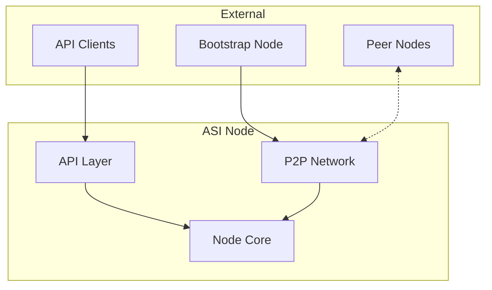
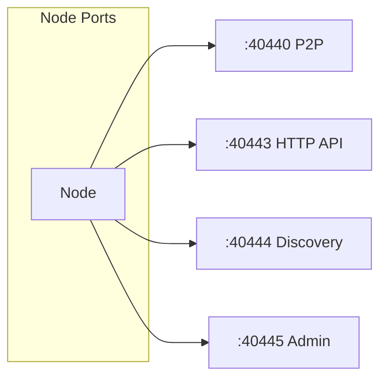
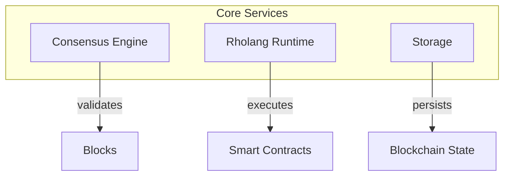
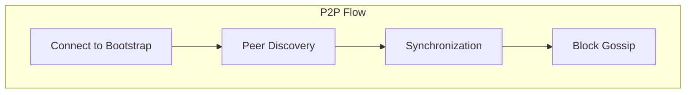

# ASI Node Architecture

The ASI Scala Node is the core blockchain engine running in Docker.

← [Back to Component Diagrams](../)

## High-Level Overview



## Port Configuration

Each node exposes multiple ports for different protocols.



| Port | Protocol | Purpose | Access |
|------|----------|---------|--------|
| 40440 | TCP | P2P communication | Public |
| 40443 | HTTP | Deploy and query API | Public |
| 40444 | UDP | Peer discovery | Public |
| 40445 | HTTP | Admin API | Localhost only |

## Core Services

The node core handles consensus and smart contract execution.



| Service | Function |
|---------|----------|
| Consensus Engine | CBC Casper block validation and finalization |
| Rholang Runtime | Smart contract execution environment |
| Storage Layer | Block and state persistence (LMDB) |

## API Layer

HTTP and gRPC interfaces for client interaction.

```mermaid
graph LR
    subgraph "HTTP API"
        D[/api/deploy]
        E[/api/explore-deploy]
        B[/api/blocks]
        S[/status]
    end
```

| Endpoint | Method | Purpose |
|----------|--------|---------|
| `/api/deploy` | POST | Submit signed deploy |
| `/api/explore-deploy` | POST | Read-only query |
| `/api/blocks` | GET | Block information |
| `/status` | GET | Node status |

## P2P Networking

Nodes communicate using the Kademlia protocol.



| Phase | Description |
|-------|-------------|
| Bootstrap | Initial connection to known node |
| Discovery | Find and connect to peers |
| Sync | Download missing blocks |
| Gossip | Propagate new blocks/deploys |

## Configuration Files

| File | Purpose |
|------|---------|
| `rnode.conf` | Network and node settings |
| `logback.xml` | Logging configuration |
| Validator keys | Private key for signing |

---

## Related Documentation

- [Validator Setup](/quick-start/join-validator/) - How to run a validator
- [Observer Setup](/quick-start/join-observer/) - Read-only node setup
- [Node Lifecycle](../../state-diagrams/) - Node states
