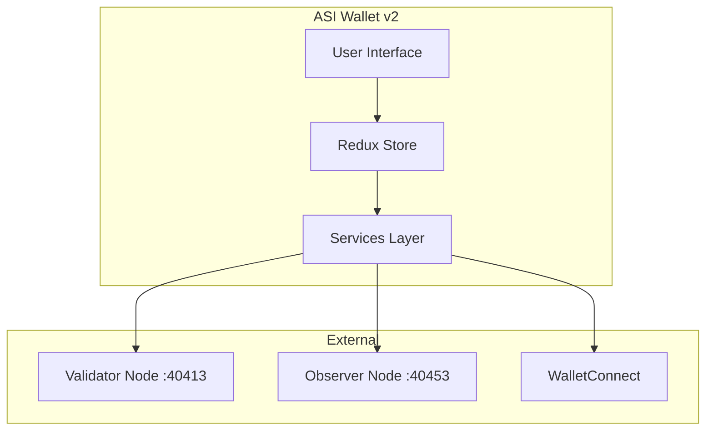
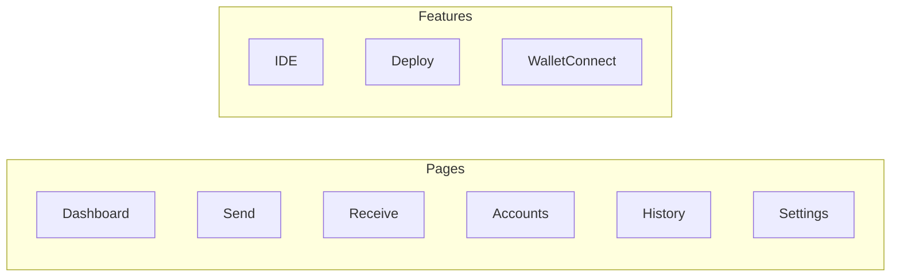
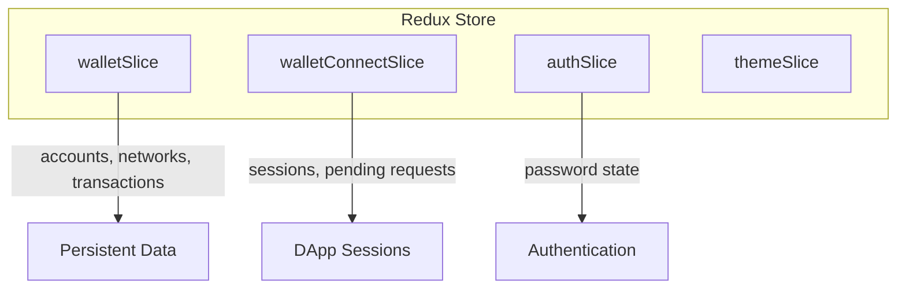
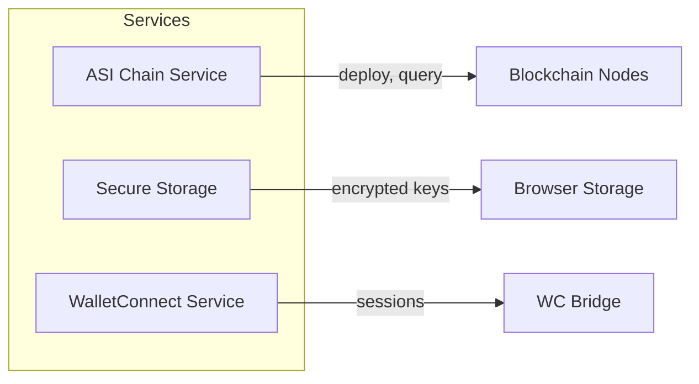

# Wallet Architecture

The ASI Wallet v2 is a browser-based React application for managing accounts and transactions.

← [Back to Component Diagrams](../)

## High-Level Overview

## UI Layer

The user interface consists of React components organized by feature.

| Page | Purpose |
|------|---------|
| Dashboard | Balance overview, quick actions |
| Send/Receive | Token transfers |
| Accounts | Account management |
| History | Transaction history |
| IDE | Rholang code editor |
| Deploy | Smart contract deployment |

## State Management

Redux store slices manage application state.

| Slice | Data Managed |
|-------|--------------|
| walletSlice | Accounts, networks, transactions |
| walletConnectSlice | DApp sessions, pending requests |
| authSlice | Password and unlock state |
| themeSlice | UI theme preferences |

## Services Layer

Services handle external communication and data management.

| Service | Responsibility |
|---------|---------------|
| ASI Chain Service | Balance queries, deploys, transactions |
| Secure Storage | Encrypted private key storage |
| WalletConnect | DApp connection management |

## Node Connections

The wallet connects to different nodes for different operations.

| Operation | Node | Port | Purpose |
|-----------|------|------|---------|
| Send tokens | Validator | :40413 | Write operations |
| Check balance | Observer | :40453 | Read operations |
| Deploy contract | Validator | :40413 | Write operations |

---

## Related Documentation

- [Wallet Usage Guide](/wallet/usage/) - How to use the wallet
- [Transaction Flow](../../sequence-diagrams/transaction/) - Transaction lifecycle
- [WalletConnect Integration](/wallet/custom-network/) - DApp connections
