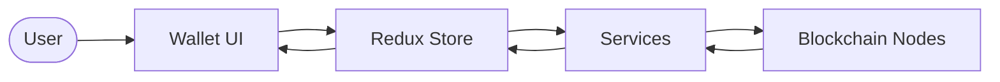
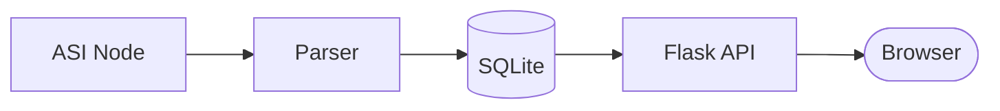
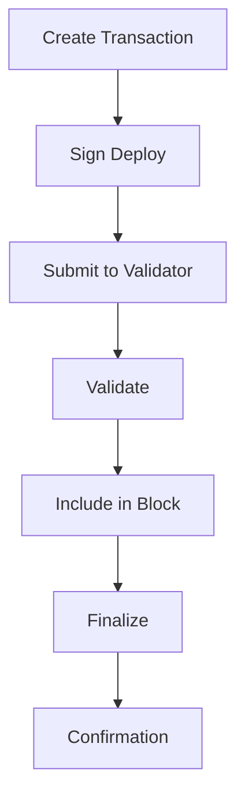

# Data Flow Diagrams

How data moves through the ASI:Chain ecosystem.

← [Back to Architecture Overview](../)

## Wallet Data Flow

Data flow from user actions to blockchain.

### Flow Details

| Layer | Input | Output |
|-------|-------|--------|
| UI | User actions | Display updates |
| Store | State changes | Persisted state |
| Services | API calls | Responses |
| Nodes | Deploys/queries | Results |

### Data Types

| Type | Encryption | Storage |
|------|------------|---------|
| Private keys | AES-256 | Browser |
| Transactions | Signed | Blockchain |
| Balances | None | In-memory |

---

## Explorer Data Flow

Blockchain data to user interface.

### Indexing Pipeline

| Source | Process | Storage |
|--------|---------|---------|
| Docker logs | Parse blocks | blocks table |
| RPC API | Get details | deployments table |
| HTTP API | Query balance | Live query |

---

## Transaction Lifecycle

End-to-end transaction flow.

| Stage | Component |
|-------|-----------|
| Create/Sign | Wallet |
| Submit/Validate | Validator |
| Block | Consensus |
| Finalize | Network |

---

## Related Documentation

- [Sequence Diagrams](../sequence-diagrams/) - Detailed interactions
- [Component Diagrams](../component-diagrams/) - Internal structure
- [Network Topology](../network-topology/) - Infrastructure
