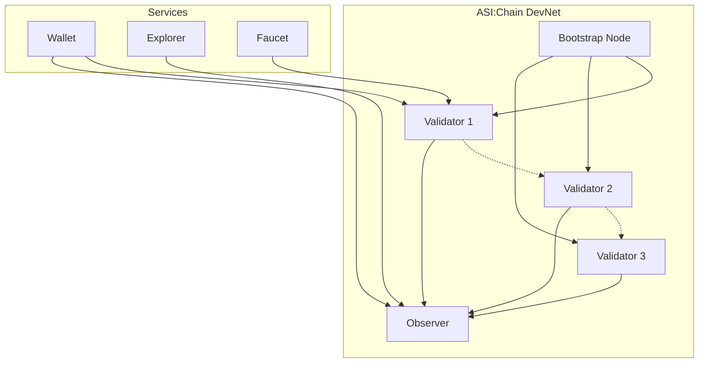
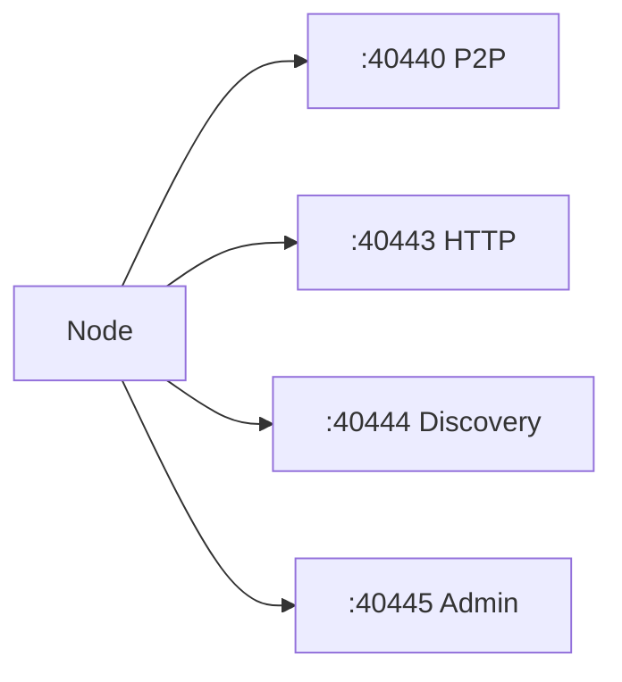

# Network Topology

ASI:Chain network infrastructure and node connections.

← [Back to Architecture Overview](../)

## Network Overview



## Network Components

### Bootstrap Node

Entry point for new nodes joining the network.

| Property | Value |
|----------|-------|
| IP | `54.152.57.201` |
| Port | `40400` |
| Purpose | Network discovery |

### Validators

Nodes that participate in consensus.

| Function | Description |
|----------|-------------|
| Block production | Propose new blocks |
| Consensus | Vote on block validity |
| API | Accept deploys |

### Observer

Read-only node for queries.

| Function | Description |
|----------|-------------|
| Block sync | Receive finalized blocks |
| Queries | Balance and state lookups |
| Explorer | Data source for explorer |

## Port Configuration



| Port | Protocol | Purpose | Access |
|------|----------|---------|--------|
| 40440 | TCP | P2P communication | Public |
| 40443 | HTTP | API (deploy, query) | Public |
| 40444 | UDP | Peer discovery | Public |
| 40445 | HTTP | Admin API | Localhost |

## External Services

| Service | URL | Node |
|---------|-----|------|
| Wallet | wallet.dev.asichain.io | Validator + Observer |
| Explorer | explorer.dev.asichain.io | Observer |
| Faucet | faucet.dev.asichain.io | Validator |

## Firewall Configuration

Required ports for validators:

```bash
# Required for P2P
ufw allow 40440/tcp
ufw allow 40444/udp

# Optional for API
ufw allow 40443/tcp
```

---

## Related Documentation

- [DevNet Structure](/shard-nodes/devnet-structure/) - Network details
- [Validator Setup](/quick-start/join-validator/) - Join as validator
- [Observer Setup](/quick-start/join-observer/) - Join as observer
