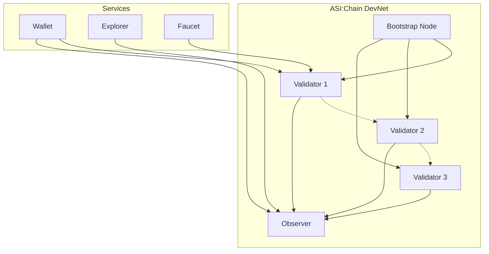
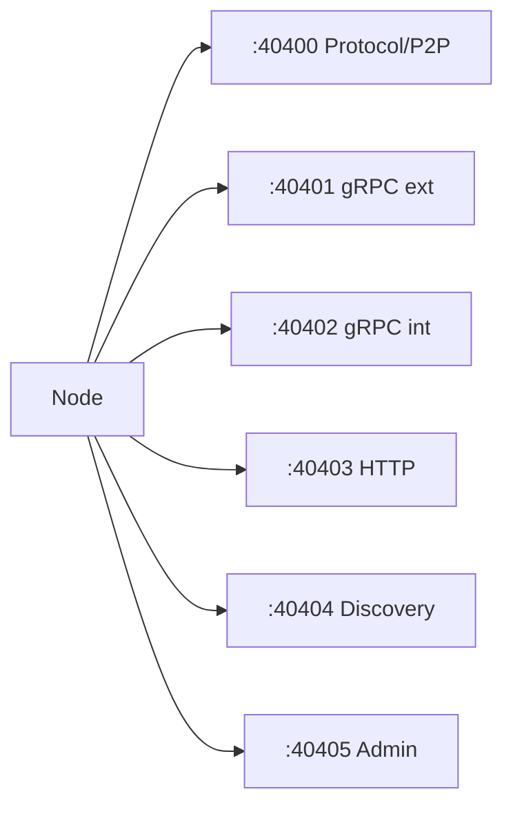

# Network Topology

ASI:Chain network infrastructure and node connections.

← [Back to Architecture Overview](../)

## Network Overview


```mermaid
graph TB
    subgraph "ASI:Chain DevNet"
        B[Bootstrap Node]
        V1[Validator 1]
        V2[Validator 2]
        V3[Validator 3]
        O[Observer]
    end
    
    subgraph "Services"
        W[Wallet]
        E[Explorer]
        F[Faucet]
    end
    
    B --> V1
    B --> V2
    B --> V3
    
    V1 -.-> V2
    V2 -.-> V3
    
    V1 --> O
    V2 --> O
    V3 --> O
    
    W --> V1
    W --> O
    E --> O
    F --> V1
```

## Network Components

### Bootstrap Node (`mettacycle-devnet-1`)

Entry point for new nodes joining the network.

| Property | Value |
|----------|-------|
| IP | `54.152.57.201` |
| Protocol port | `40400` |
| HTTP API | `40403` |
| Purpose | Network discovery + write-API host |

### Validators (3 active)

Three nodes participate in consensus.

| VM | Public API exposure |
|----|---------------------|
| Validator 1 (`mettacycle-devnet-2`, `34.196.119.4`) | **Public** — `http://34.196.119.4:40403` (write + read) |
| Validator 2 (`mettacycle-devnet-3`) | Internal — consensus only |
| Validator 3 (`mettacycle-devnet-4`) | Internal — consensus only |

| Function | Description |
|----------|-------------|
| Block production | Propose new blocks |
| Consensus | Vote on block validity (CBC Casper) |
| Public API (Validator 1 only) | Accept deploys + serve read queries |

::: tip
Validator 1 also handles all read traffic because the dedicated observer is currently unstable.
:::

### Observer (currently unstable)

Read-only node for queries — `mettacycle-devnet-5` (`54.235.138.68`). Until it stabilizes, Validator 1 (`34.196.119.4:40403`) serves read requests.

## Port Configuration

All DevNet nodes share the same port range — each runs on its own VM.


```mermaid
graph LR
    N[Node] --> P1[":40400 Protocol/P2P"]
    N --> P2[":40401 gRPC ext"]
    N --> P3[":40402 gRPC int"]
    N --> P4[":40403 HTTP"]
    N --> P5[":40404 Discovery"]
    N --> P6[":40405 Admin"]
```

| Port | Protocol | Purpose | Access |
|------|----------|---------|--------|
| 40400 | TCP | Protocol / P2P communication | Public |
| 40401 | TCP | Public gRPC API | Public |
| 40402 | TCP | Internal gRPC API | Localhost |
| 40403 | HTTP | API (deploy, query) | Public |
| 40404 | UDP | Kademlia peer discovery | Public |
| 40405 | HTTP | Admin API | Localhost |

## External Services

| Service | URL | Backend |
|---------|-----|---------|
| Wallet | wallet.dev.asichain.io | Validator 1 (write + read) |
| Explorer | explorer.dev.asichain.io | Indexer GraphQL |
| Indexer | indexer.dev.asichain.io/v1/graphql | PostgreSQL via Hasura, indexes from Validator 1 |
| Faucet | faucet.dev.asichain.io | Faucet API → Validator 1 |

## Firewall Configuration

Required ports for external validators:

```bash
# Required for P2P
ufw allow 40400/tcp
ufw allow 40404/udp

# Optional for HTTP API access
ufw allow 40403/tcp
```

---

## Related Documentation

- [DevNet Structure](/shard-nodes/devnet-structure/) - Network details
- [Validator Setup](/quick-start/join-validator/) - Join as validator
- [Observer Setup](/quick-start/join-observer/) - Join as observer
