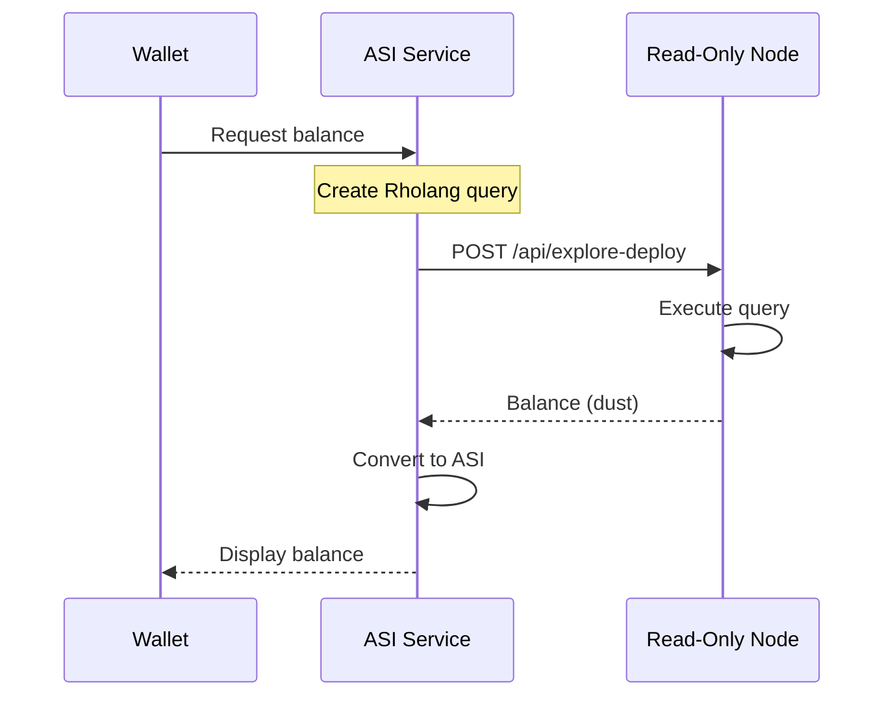

# Balance Query Flow

How the wallet retrieves and displays account balance.

← [Back to Sequence Diagrams](../)

## Overview

Balance queries are read-only operations that don't require gas fees.

## Query Flow



## Key Details

### Unit Conversion

Balance is stored in "dust" (smallest unit):

| Unit | Value |
|------|-------|
| 1 ASI | 100,000,000 dust |
| 1 dust | 0.00000001 ASI |

### Query Rholang

The balance query uses RevVault lookup:

```rholang
new return, lookup(`rho:rchain:revVault`) in {
  lookup!(*return) | for(@(_, Vault) <- return) {
    @Vault!("findOrCreate", "ADDRESS", *return)
  }
}
```

### Auto-Refresh

The wallet automatically refreshes balance on dashboard view and after transactions.

---

## Related Documentation

- [Transaction Flow](../transaction/) - Sending tokens
- [Wallet Architecture](../../component-diagrams/wallet/) - Wallet internals
- [Explorer API](../../component-diagrams/explorer/) - Balance lookup
