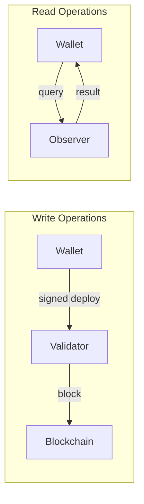

# Sequence Diagrams

Interaction flows between ASI:Chain components.

← [Back to Architecture Overview](../)

## Available Diagrams

### [Transaction Flow](./transaction/)

Complete flow from user initiating a transfer to confirmation.

- Preparation phase (signing)
- Submission to validator
- Block confirmation

### [Balance Query](./balance/)

How the wallet retrieves account balance.

- Read-only query execution
- Unit conversion (dust to ASI)
- Auto-refresh mechanism

## Quick Reference

| Operation | Nodes Involved |
|-----------|---------------|
| Send tokens | Validator + Observer |
| Check balance | Observer only |
| Deploy contract | Validator + Observer |

## Simplified Flow

---

## Related Documentation

- [Component Diagrams](../component-diagrams/) - Internal architecture
- [State Diagrams](../state-diagrams/) - Node lifecycle
- [Wallet Usage](/wallet/usage/) - User guide
