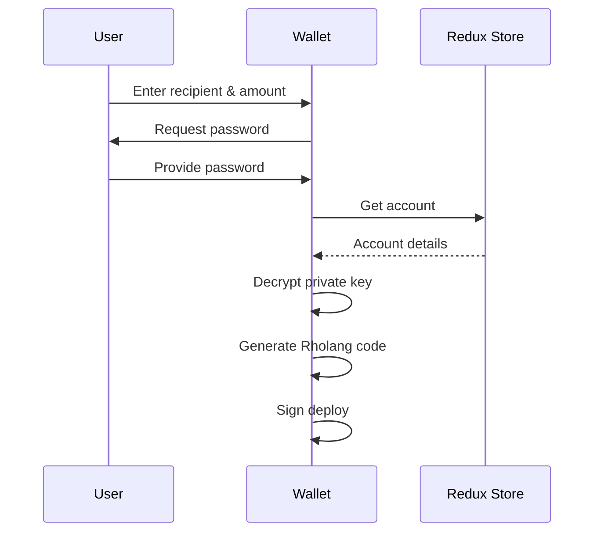
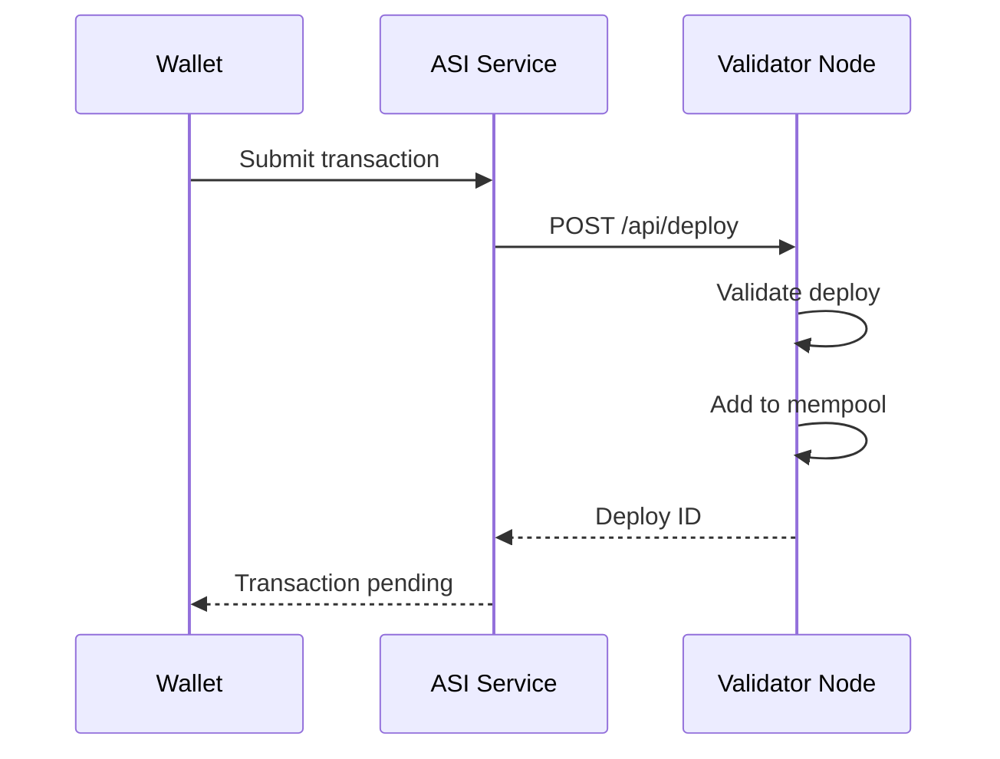
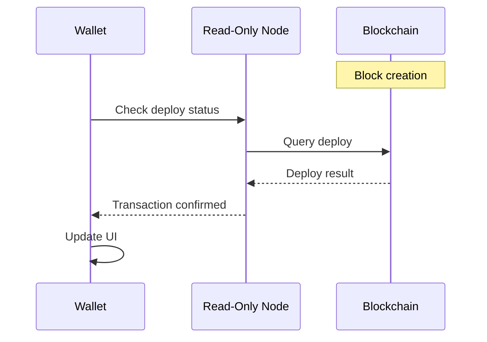

# Transaction Flow

Complete sequence from user initiating a transfer to confirmation.

← [Back to Sequence Diagrams](../)

## Overview

A token transfer goes through three main phases:

1. **Preparation** - User input and signing
2. **Submission** - Send to validator
3. **Confirmation** - Block inclusion and verification

## Phase 1: Preparation

| Step | Description |
|------|-------------|
| User input | Enter recipient address and amount |
| Password | Unlock account |
| Sign | Create signed deploy |

## Phase 2: Submission

| Step | Description |
|------|-------------|
| Submit | Send to validator |
| Validate | Check signature and syntax |
| Mempool | Queue for block inclusion |

## Phase 3: Confirmation

| Step | Description |
|------|-------------|
| Block creation | Wait for next block |
| Confirmation | Verify result |

---

## Related Documentation

- [Wallet Architecture](../../component-diagrams/wallet/) - Wallet internals
- [Balance Query](../balance/) - How balance checks work
- [Send Tokens Guide](/wallet/usage/) - Step-by-step guide
