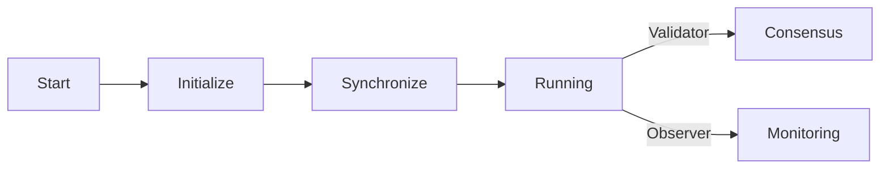

# State Diagrams

Node lifecycle and state transitions.

← [Back to Architecture Overview](../)

## Available Diagrams

### [Startup States](./startup/)

States during node initialization.

- Initializing → Connecting → Bootstrapping → Syncing → Ready
- Common startup issues and solutions

### [Operational States](./operations/)

Runtime states for active nodes.

- Validator consensus cycle (Proposing, Voting, Finalizing)
- Observer monitoring state
- Connection recovery

## Simplified Lifecycle



::: warning
The sync phase can take 1-12 hours for new nodes. See [Troubleshooting](/quick-start/troubleshooting/) for details.
:::

## Monitoring Commands

```bash
# Check current state
docker logs rnode.validator 2>&1 | tail -50

# Monitor state changes
docker logs -f rnode.validator 2>&1 | grep -E "state|sync|connected"
```

---

## Related Documentation

- [Component Diagrams](../component-diagrams/) - Node internals
- [Sequence Diagrams](../sequence-diagrams/) - Interaction flows
- [Troubleshooting](/quick-start/troubleshooting/) - Common issues
