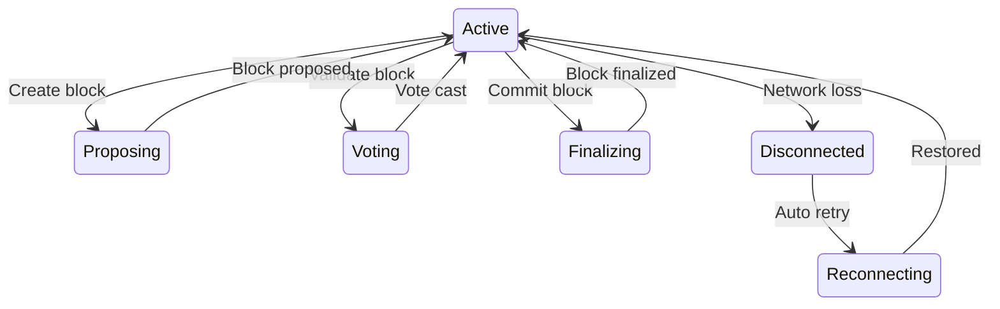
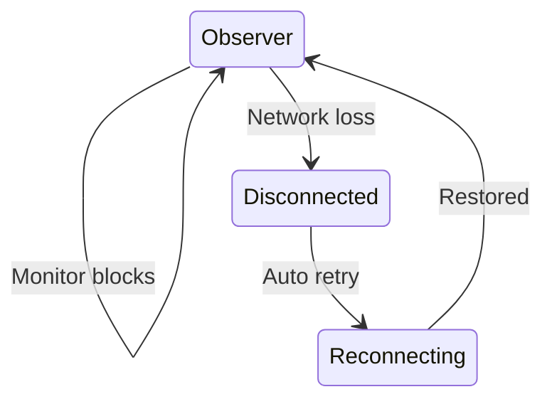

# Node Operational States

Runtime states for active validator and observer nodes.

← [Back to State Diagrams](../)

## Validator States

Active validator nodes cycle through consensus states.



## Observer States

Observer nodes monitor without participating in consensus.



## State Descriptions

### Active (Validator)

| State | Trigger | Description |
|-------|---------|-------------|
| **Proposing** | Block slot | Creating new block proposal |
| **Voting** | Received block | Validating peer's block |
| **Finalizing** | Consensus reached | Committing finalized block |

### Observer

| State | Description |
|-------|-------------|
| **Observer** | Receiving and storing blocks |
| **Disconnected** | Network connection lost |
| **Reconnecting** | Attempting to restore connection |

## Monitoring

Check current node activity:

```bash
# Watch consensus activity
docker logs -f validator 2>&1 | grep -E "propose|vote|finalized"

# Check connection status
docker logs validator 2>&1 | grep -i "connected\|disconnected"
```

## Connection Recovery

| Scenario | Auto-Recovery |
|----------|---------------|
| Brief network drop | Yes, automatic |
| Extended outage | Yes, with resync |
| Bootstrap unreachable | Retry with backoff |

---

## Related Documentation

- [Startup States](../startup/) - Node initialization
- [Network Topology](../../network-topology/) - Node connections
- [Troubleshooting](/quick-start/troubleshooting/) - Common issues
