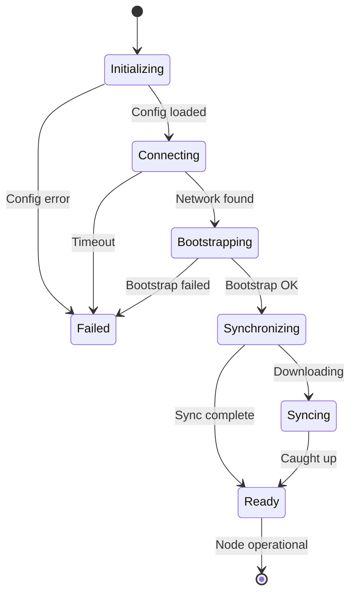

# Node Startup States

States during node initialization and synchronization.

← [Back to State Diagrams](../)

## Startup Sequence

Normal startup follows this path:



## State Descriptions

| State | Description |
|-------|-------------|
| **Initializing** | Loading config and keys |
| **Connecting** | Finding bootstrap node |
| **Bootstrapping** | Getting network info |
| **Synchronizing** | Starting block download |
| **Syncing** | Downloading blocks |
| **Ready** | Node operational |

::: warning Long Sync Time
Initial synchronization can take **1-12 hours** depending on network state and block count. This is documented in the [Troubleshooting](/quick-start/troubleshooting/) guide.
:::

## Common Issues

### Stuck in Connecting

```bash
# Check network connectivity
ping 54.152.57.201

# Verify port 40400 is reachable
nc -zv 54.152.57.201 40400
```

### Stuck in Syncing

```bash
# Monitor sync progress
docker logs -f rnode.validator 2>&1 | grep -i "sync\|finalized"
```

### Failed State

If node enters Failed:

1. Check logs: `docker logs rnode.validator`
2. Verify configuration
3. Restart: `docker compose restart`

---

## Related Documentation

- [Operational States](../operations/) - Runtime states
- [Validator Setup](/quick-start/join-validator/) - Setup guide
- [Troubleshooting](/quick-start/troubleshooting/) - Common issues
