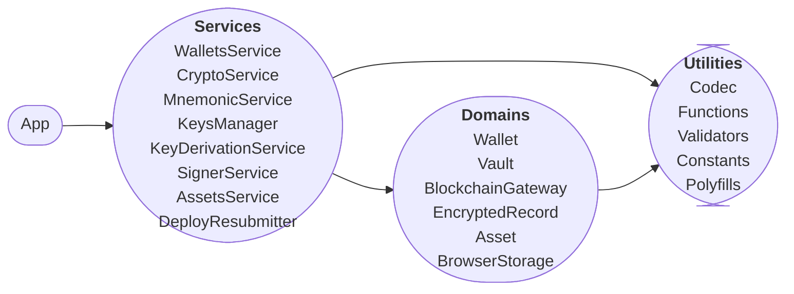
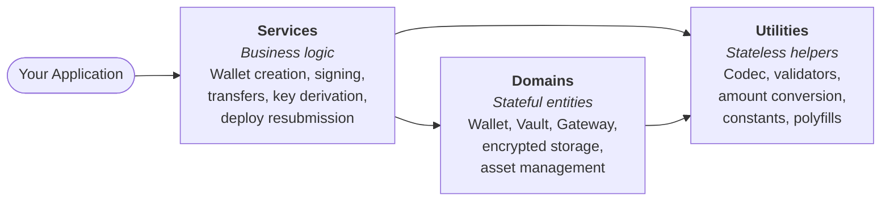
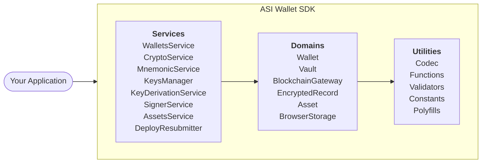
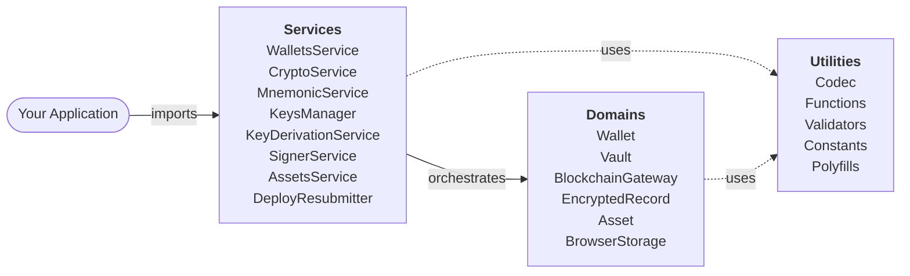
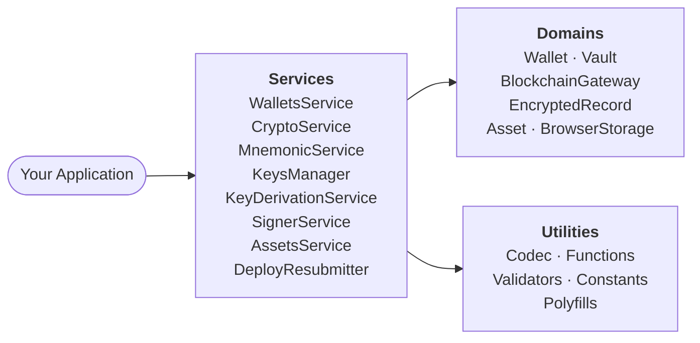
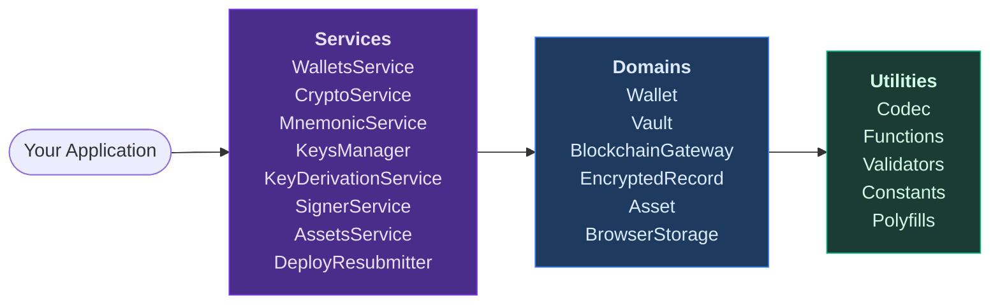

# Wallet SDK

A lightweight, modular SDK for wallet integration and key management on [ASI Chain](https://github.com/asi-alliance/asi-chain). The SDK provides secure cryptographic operations, BIP-39/BIP-44 key derivation, encrypted storage mechanisms, and direct interaction with ASI Chain nodes.

**GitHub**: [asi-alliance/asi-chain-wallet-sdk](https://github.com/asi-alliance/asi-chain-wallet-sdk)

## Key Features

- **Wallet Management** — Create, import, and derive wallets from private keys or mnemonic phrases
- **Secure Storage** — Password-based encryption using PBKDF2 + AES
- **Key Derivation** — BIP-39 mnemonic generation and BIP-44 hierarchical deterministic key derivation
- **Vault System** — Encrypted container for managing multiple wallets and seeds
- **Chain Interaction** — Transfer and balance operations via BlockchainGateway
- **Address Generation** — secp256k1 key generation with keccak256/blake2b address derivation

## Installation

```bash
npm install asi-wallet-sdk
```

## Quick Start

### Create a New Wallet

```typescript
import { WalletsService, MnemonicService } from 'asi-wallet-sdk';

// Generate a new wallet with random keys
const wallet = WalletsService.createWallet();
console.log('Address:', wallet.address);
console.log('Public Key:', wallet.publicKey);

// Create wallet from mnemonic
const mnemonic = MnemonicService.generateMnemonic();
const derivedWallet = await WalletsService.createWalletFromMnemonic(mnemonic, 0);
console.log('Derived Address:', derivedWallet.address);
```

### Manage Wallets with Vault

```typescript
import { Vault, Wallet } from 'asi-wallet-sdk';

// Create vault and add wallet
const vault = new Vault();

// Add wallet to vault
const wallet = await Wallet.fromPrivateKey('My Wallet', privateKey, 'wallet-password');
vault.addWallet(wallet);

// Save vault to localStorage
await vault.lock('vault-password');
vault.save();
```

### Check Balance and Transfer

```typescript
import { AssetsService, BlockchainGateway } from 'asi-wallet-sdk';

BlockchainGateway.init({
  validator: { baseUrl: 'http://validator-node:40403' },
  indexer: { baseUrl: 'http://observer-node:40403' },
});
const assetsService = new AssetsService();

// Get ASI balance
const balance = await assetsService.getASIBalance(address);
console.log('Balance:', balance.toString());

// Transfer tokens
const deployId = await assetsService.transfer(
  fromAddress,
  toAddress,
  BigInt(1000000000), // 10 ASI in atomic units
  wallet,
  passwordProvider
);
```

## Module Architecture

The SDK is organized into three layers — **Services**, **Domains**, and **Utilities** — each covering its own logical scope. Modules within a layer are independent of each other and communicate only through well-defined interfaces.

### C1 — Базовый LR с round-edge нодами



---

### C2 — LR с описаниями вместо списков



---

### C3 — LR с subgraph-обёрткой SDK



---

### C4 — LR с пунктирными стрелками и аннотациями



---

### C5 — LR с разделением на 2 колонки: Domains + Utilities



---

### C6 — Flowchart LR со стилизацией



**Services** implement business logic and orchestrate other modules:
- `WalletsService` — entry point for wallet creation from private keys or mnemonics.
- `MnemonicService` / `KeyDerivationService` / `KeysManager` — handle the cryptographic derivation pipeline (BIP-39 → BIP-44 → secp256k1).
- `CryptoService` — provides PBKDF2 + AES-GCM encryption used by `Wallet` and `EncryptedRecord`.
- `SignerService` — signs deploys using the wallet's scoped signing capability (private key never exposed).
- `AssetsService` — combines signing, gateway calls, and address validation for token transfers and balance queries.
- `DeployResubmitter` — wraps `AssetsService` with retry logic and status polling.

**Domains** represent stateful entities:
- `Wallet` — holds an encrypted private key and enforces that the key is only accessible within a scoped callback (`withSigningCapability`).
- `Vault` — manages multiple wallets and encrypted seeds in browser `localStorage`; all access is guarded by lock/unlock.
- `BlockchainGateway` — singleton that routes deploys to the validator and queries to the indexer.
- `EncryptedRecord` — stores BIP-39 seeds encrypted with the same AES-GCM scheme used for private keys.
- `Asset` — token model holding identifier, name, and decimal precision.
- `BrowserStorage` — thin `localStorage` wrapper with prefix-based key isolation.

**Utilities** are stateless helpers used across the SDK:
- `Codec` — Base16, Base58, and Base64 encode/decode functions.
- `Functions` — atomic unit conversion (`toAtomicAmount`, `fromAtomicAmountToString`).
- `Validators` — address checksum validation and account name checks.

## Cryptographic Flow

- **Key Generation**: secp256k1 elliptic curve keypairs
- **Address Derivation**: keccak256 hash → blake2b checksum → Base58 encoding with chain prefix
- **Encryption**: PBKDF2 (100,000 iterations) → AES-GCM
- **Mnemonic**: BIP-39 standard (12/24 words)
- **Derivation Path**: BIP-44 (`m/44'/60'/0'/0/index`)

## Dependencies

| Package | Version | Purpose |
|---------|---------|---------|
| [axios](https://github.com/axios/axios) | 1.13.2 | HTTP client for node communication |
| [bip32](https://github.com/bitcoinjs/bip32) | 4.0.0 | BIP-32 hierarchical deterministic wallets |
| [bip39](https://github.com/bitcoinjs/bip39) | 3.1.0 | BIP-39 mnemonic generation |
| [blakejs](https://github.com/dcposch/blakejs) | 1.2.1 | BLAKE2b hashing for addresses |
| [bs58](https://github.com/cryptocoinjs/bs58) | 6.0.0 | Base58 encoding |
| [buffer](https://github.com/feross/buffer) | 6.0.3 | Node.js `Buffer` polyfill for browser environments |
| [@noble/hashes](https://github.com/paulmillr/noble-hashes) | 1.6.0 | Cryptographic hash helpers |
| [@noble/secp256k1](https://github.com/paulmillr/noble-secp256k1) | 1.7.0 | secp256k1 key generation and signing |
| [js-sha3](https://github.com/nicknisi/js-sha3) | 0.9.3 | keccak256 hashing |
| [tiny-secp256k1](https://github.com/nicknisi/tiny-secp256k1) | 2.2.4 | secp256k1 for BIP-32 derivation |

## Prerequisites

- Node.js 18.x or higher
- npm 9.x or higher

## Related Resources

| Resource | Link |
|----------|------|
| ASI Chain Documentation | [docs.asichain.io](https://docs.asichain.io) |
| ASI Chain Node | [github.com/asi-alliance/asi-chain](https://github.com/asi-alliance/asi-chain) |
| ASI Chain Wallet | [github.com/asi-alliance/asi-chain-wallet](https://github.com/asi-alliance/asi-chain-wallet) |
| ASI Chain Explorer | [github.com/asi-alliance/asi-chain-explorer](https://github.com/asi-alliance/asi-chain-explorer) |
| ASI Chain Faucet | [github.com/asi-alliance/asi-chain-faucet](https://github.com/asi-alliance/asi-chain-faucet) |
